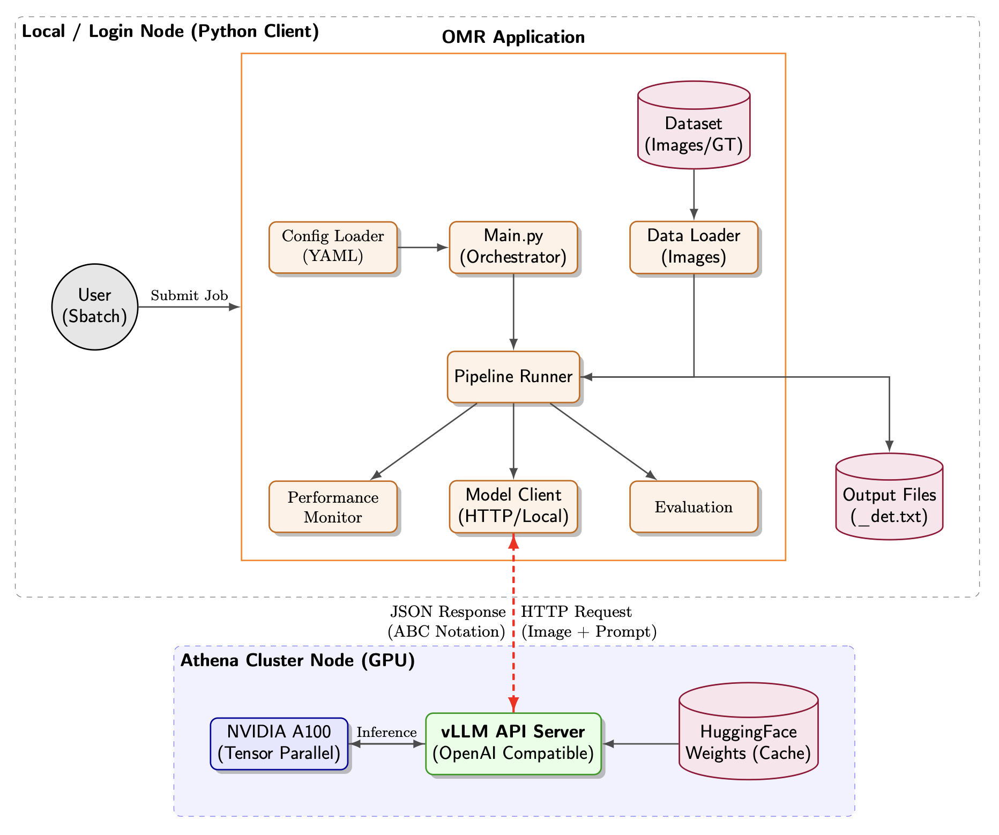

# Optical Music Recognition (OMR) Pipeline

## Project Overview

This project implements an Optical Music Recognition pipeline designed to transcribe handwritten sheet music into ABC notation using advanced Vision Language Models (VLMs). The system supports both **local execution** (optimized for macOS/MPS) using smaller models like **Qwen2-VL** and **SmolVLM**, and **high-performance cluster execution** (on Athena Supercomputer) utilizing massive models such as **Gemma 3 27B** and **InternVL 3 78B** served via **vLLM**.

The pipeline manages the entire lifecycle: environment setup, model caching, inference via direct loading or API server, resource monitoring, and evaluation against ground truth data.



## Project Structure

### Source & Configuration

```text
Optical-Music-Recognition/
├── .env                              # Environment variables (HF Token)
├── .gitignore                        # Git ignore rules
├── main.py                           # Main Python entry point
├── requirements.txt                  # Python dependencies
├── config/
│   ├── main_config.yaml              # Active experiment selection
│   ├── models_config.yaml            # Model parameters, IDs & API bases
│   ├── paths_config.yaml             # Directory paths configuration
│   ├── plans_config.yaml             # Experiment plans & data filtering
│   └── prompts.yaml                  # System prompts for VLM
├── data/
│   ├── line_000/
│   │   ├── line_000.png              # Input image
│   │   ├── line_000.txt              # Ground truth (ABC Notation)
│   │   └── line_000_det.txt          # Output (Generated by system)
│   ├── line_001/
│   │   └── ...
│   └── ...
├── scripts/
│   ├── run_local_ollama_model.sh        # Bash script for local execution
│   ├── run_gemma_3_27b_athena.sbatch    # SLURM script for Gemma 3 on Athena
│   └── run_intern_vl3_78b_athena.sbatch # SLURM script for InternVL 3 on Athena
└── src/
    ├── __init__.py
    ├── data_loader.py                # Data loading & filtering logic
    ├── evaluation.py                 # Levenshtein & SER metrics
    ├── loggers.py                    # Logging configuration
    ├── monitor.py                    # Hardware usage & TPS monitoring
    └── pipeline/
        ├── __init__.py
        ├── model_client.py           # Clients for local models & vLLM API
        └── runner.py                 # Main inference loop
```

### Output Files & Artifacts

After execution, the following files are generated:

```text
├── logs/
│   ├── run_YYYY_MM_DD_HH_MM_SS.txt   # Execution logs
│   ├── athena_run_{JOB_ID}.out       # SLURM stdout logs
│   ├── vllm_server.log               # vLLM server logs (on cluster)
│   ├── cpu_usage.png                 # Hardware monitoring plots
│   └── latency.png                   # Performance metrics plots
├── .cache/                           # Model weights cache (on SCRATCH for Athena)
├── omr_venv/                         # Local virtual environment
├── omr_venv_athena/                  # Athena virtual environment
└── data/
    └── {ID}/
        └── {ID}_det.txt              # Generated detection file
```

## Setup Instructions

### 1. Hugging Face Token

Access to models like Gemma 3 and InternVL 3 often requires acceptance of license terms on Hugging Face.

1.  Obtain a User Access Token with `read` permissions from Hugging Face Settings.
2.  Create a file named `.env` in the root directory.
3.  Add the token to the file:

```bash
HF_TOKEN=hf_YourTokenHere
```

### 2. Data Preparation

Organize your dataset in the `data/` directory. Each image must have its own subdirectory. The pipeline supports filtering folders based on line numbers (e.g., `line_000` to `line_010`).

**Structure:**

```text
data/
├── line_000/
│   ├── line_000.png      # Input image
│   ├── line_000.txt      # Ground truth
│   └── ...
```

## Execution Modes

The project supports two primary execution environments: Local Machine and Athena Supercomputer.

### A. Local Execution (macOS/Linux)

Use this mode for smaller models (e.g., Qwen2-VL-2B, SmolVLM) or development.

1.  **Configure**: Set `active_experiment_plan` in `config/main_config.yaml` to a local plan (e.g., `plan_omr_qwen2_vl`).
2.  **Run**:
    ```bash
    chmod +x ./scripts/run_local_ollama_model.sh
    ./scripts/run_local_ollama_model.sh
    ```

This script sets up a local virtual environment (`omr_venv`), installs dependencies, and runs the inference pipeline directly.

### B. Athena Supercomputer Execution (vLLM)

Use this mode for large-scale models like Gemma 3 27B and InternVL 3 78B. This setup leverages **vLLM** as an inference server to handle massive models efficiently.

#### Athena Prerequisites

*   **Access**: You need access to the Athena cluster at Cyfronet.
*   **Grant**: A valid PLGrid computing grant with GPU resources (specifically `plgrid-gpu-a100`).
*   **Resources**: Athena provides nodes with NVIDIA A100 (40GB/80GB) GPUs.
    *   Documentation: [Athena Docs](https://docs.cyfronet.pl/spaces/~plgpawlik/pages/126648338/Athena)

#### Running on Athena

1.  **Configure Plan**:
    *   Open `config/main_config.yaml`.
    *   Set `active_experiment_plan` to either `plan_omr_gemma3_vllm` or `plan_omr_internvl3`.

2.  **Configure SLURM Script**:
    *   Open the corresponding script in `scripts/` (e.g., `run_gemma_3_27b_athena.sbatch`).
    *   **CRITICAL**: Replace `GRANT_NAME` in `#SBATCH -A GRANT_NAME` with your actual grant ID (e.g., `plgnn2025-gpu-a100`).

3.  **Submit Job**:
    ```bash
    sbatch scripts/run_gemma_3_27b_athena.sbatch
    # OR
    sbatch scripts/run_intern_vl3_78b_athena.sbatch
    ```

#### Athena Process Flow

1.  **Environment**: The script loads required modules (`Python/3.10.4`, `CUDA/12.4.0`) and creates a virtual environment in `$SCRATCH` (`omr_venv_athena`).
2.  **vLLM Server**: It launches an OpenAI-compatible API server using `python -m vllm.entrypoints.openai.api_server`.
    *   **Gemma 3 27B**: Uses 2x A100 GPUs via Tensor Parallelism (`--tensor-parallel-size 2`).
    *   **InternVL 3 78B**: Uses 4x A100 GPUs via Tensor Parallelism (`--tensor-parallel-size 4`).
3.  **Wait**: The script waits until the vLLM server is fully ready and responding to health checks (this may take 5-20 minutes for large models).
4.  **Inference**: Once ready, `main.py` is executed. The Python client connects to `http://localhost:8000/v1` to send images and prompts.
5.  **Cleanup**: The vLLM server process is terminated automatically after inference completes.

## Configuration Details

### `config/main_config.yaml`
Selects the active experiment plan.

### `config/plans_config.yaml`
Defines experiment scenarios.
*   `model_key`: Reference to a model in `models_config.yaml`.
*   `prompt_key`: Reference to a prompt in `prompts.yaml`.
*   `line_range`: (Optional) List `[start, end]` to filter specific data folders (e.g., `[0, 10]` processes `line_000` through `line_010`).

### `config/models_config.yaml`
Defines model parameters.
*   **Local Models**: Use `model_id` and `model_kwargs` (e.g., `dtype: "bfloat16"`).
*   **vLLM Models**: Use `api_base` (e.g., `http://localhost:8000/v1`) to direct requests to the vLLM server. Parameters like `max_new_tokens` and `temperature` are defined in `generate_kwargs`.

### `config/prompts.yaml`
Contains system prompts.
*   **omr_abc_strict**: Standard prompt with detailed visual recognition rules.
*   **omr_abc_long**: Extended prompt variant.
*   **Note**: The prompt structure is critical. The model is instructed to output strictly ABC notation starting with `M:`.

## ABC Notation Overview

The system outputs strict ABC notation:
*   **Header**: `M:4/4` (Meter), `L:1/4` (Unit Length), `K:C` (Key).
*   **Notes**: Pitch (C, D, E...), Duration (E2, E/2).
*   **Structure**: `|` (Bar line), `z` (Rest).

## Supported Models

1.  **Local (Transformers)**:
    *   Qwen2-VL-2B-Instruct
    *   SmolVLM2-2.2B-Instruct
2.  **Cluster (vLLM)**:
    *   **google/gemma-3-27b-it**: High-performance multimodal model. Requires 2x A100.
    *   **OpenGVLab/InternVL3-78B**: Massive SOTA vision-language model. Requires 4x A100.

## Limitations

*   **Local Execution**: Limited by available VRAM. Large models (27B+) cannot run locally on most consumer hardware.
*   **vLLM Overhead**: Starting the vLLM server takes time (loading weights). SLURM jobs must request sufficient time limits.
*   **Complex Notation**: While simple melodies are recognized well, complex polyphony and dense chords remain challenging.
```